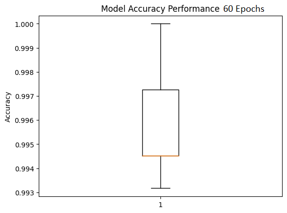
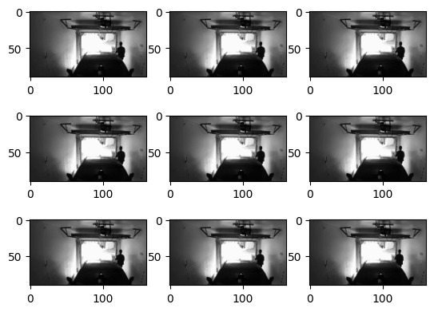
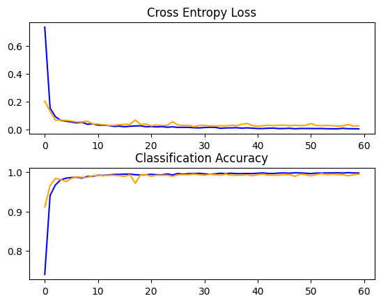
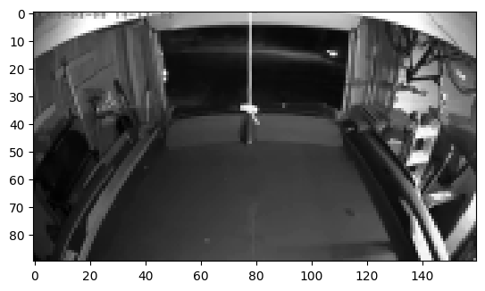
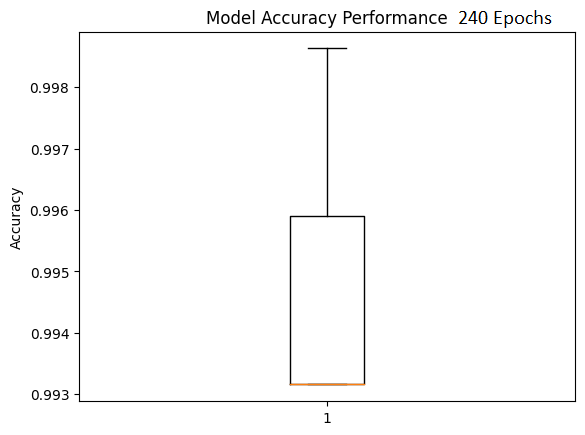
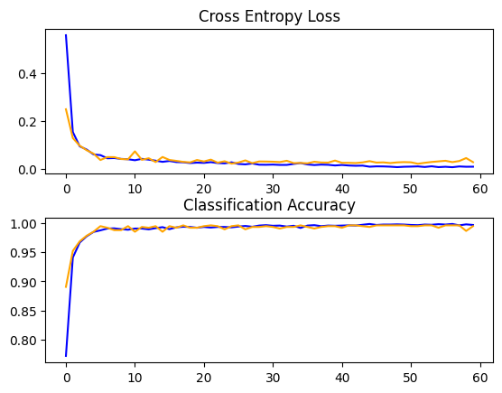
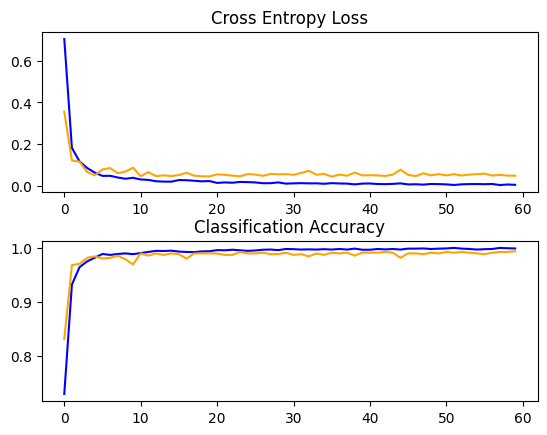
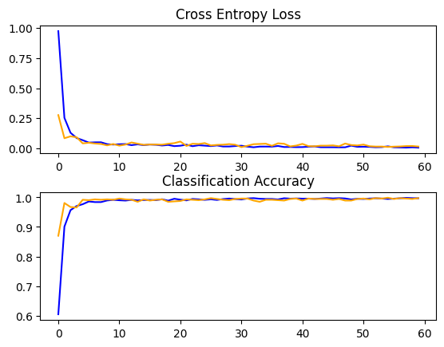
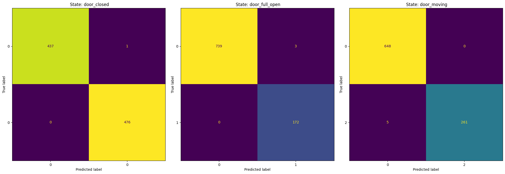

\### Project Title

Is the garage door closed?

\*\*Author\*\*

James Citta

\#### Executive summary

Is the garage door open or closed? Determined only by data from the
camera viewing the door / garage area. This will require pixel data from
the camera to classify if there is a door present (closed and in the
way) or not (up clear of the opening.)

\#### Rationale

Why should anyone care about this question?

This is something that customers always want to know, is the garage shut
and secure. And having a method that is independent of the garage door
opener, and doesn\'t require attaching a sensor to the door is quite
desirable; since monitoring that area; when the door is open is also
quite desirable.

\#### Research Question

What are you trying to answer?

Is the garage door open or closed? Determined only by data from the
camera viewing the door / garage area. This will require pixel data from
the camera to classify if there is a door present or not.

\#### Data Sources

What data will you use to answer your question?

High resolution (1080p) 24 bit color video from customers garages with
the camera aiming down and out toward the garage door. My employer
already has a labeled set of data, from Beta customers. Video will be
converted to stills for the purpose of this capstone. Images will be
downsized (using ff-mpeg/opencv) to 160 by 90 pixels and turned to
single channel grayscale to allow for faster processing, and limitations
in GPU ram.

\#### Methodology

What methods are you using to answer the question?

Preprocess the video still dataset down to 160 by 90 pixel grayscale
images.

{width="5.65625in"
height="3.3958333333333335in"}

Split the dataset to test and training set 20/80 percent split.

{width="5.65625in"
height="4.072916666666667in"}

Start with a Convolutional Neural Network (CNN) and feed that into a
softmax activation to classify if the door is there (and closed) or up
and thus is open. Train with thousands of images.

\#### Results

What did your research find?

Even with the limited dataset, training a CNN to classify door state is
possible and that classification works quite well.

{width="3.0704451006124236in"
height="2.37in"}{width="3.339737532808399in"
height="2.39in"}

{width="3.12in"
height="2.31577646544182in"}{width="3.23in"
height="2.201831802274716in"}

The graphs show that going past 60 epochs with this model the accuracy
starts to go down so it is just wasting computation. But 60 epochs out
performs 30 epochs. An average accuracy of [99.590 with a standard
deviation of 0.245 across five folds is excellent performance of the
model.]{.mark}

The blue lines (shown below) indicate model performance, and the orange
lines are the performance on the testing dataset. We can see with these
lines the model is coveraging nicely and isn't showing signs of over or
under fitting.

{width="3.2327405949256343in"
height="2.5364588801399823in"}{width="2.9427088801399823in"
height="2.581809930008749in"}

{width="3.213542213473316in"
height="2.4270833333333335in"}{width="2.9895833333333335in"
height="2.324352580927384in"}{width="3.2343755468066493in"
height="2.34375in"}

{width="6.815972222222222in"
height="2.3593755468066493in"}

The confusion matrix shows the hardest state to predict is door moving.
That isn\'t really too much of a surprise, while labeling them right
before a door is fully open or closed it isn't very different from being
or fully or closed respectively. With just 5 false negatives and no
false positives the model is doing quite well.

That said, the initial design only works on a single door at a time.

Future Actions:

More training data: the dataset is not large as originally planned, and
only contains three different garage doors. So more different doors,
more dynamic lighting, and motion in the garage (like people moving
around), more objects blocking the camera\'s view.

The way the model/data is setup can't yet handle having two doors
opening independently of each other. There isn't enough data of this
happening and while I was hand label everything I was not set up to
handle more than one door.

I'd like to look into adding partial image compression techniques to
further reduce the amount of data that needs to be handled. In
particular I'd like to run the images through a 2d walsh-hadamard
transform, which can be used instead of a Discrete Cosine Transform in
jpeg compression.

\#### Outline of project

\- https://github.com/jwcitta/Capstone-Project()

\-
https://github.com/jwcitta/Capstone-Project/blob/main/capstone_github.ipynb

\- \[Link to notebook 3\]()

\##### Contact and Further Information
