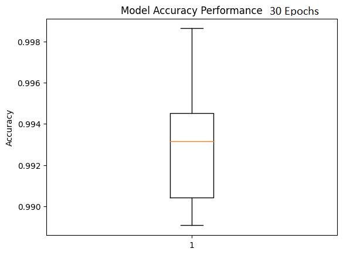
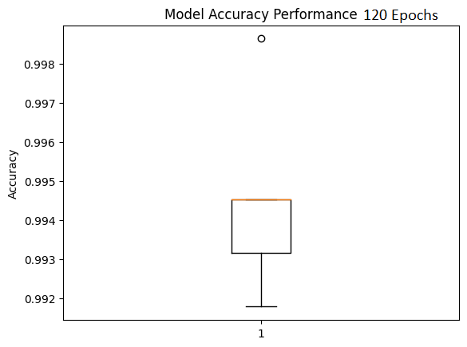
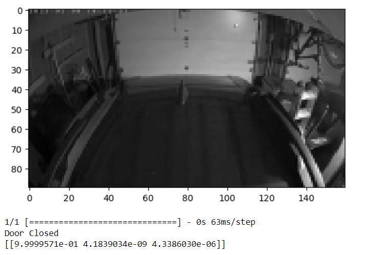

\### Project Title

Is the garage door closed?

\*\*Author\*\*

James Citta

\#### Executive summary

This project addresses the common homeowner question: Is the garage door
open or closed? The answer is determined using data strictly from a
camera that monitors the door opening of the garage. The digital video
camera is then able to classify if there is a door fully present (and
thus is completely closed), if the door opening is clear (and thus is
open), or if it somewhere in-

Between. This project thoroughly explores how this answer is determined.

\#### Rationale

Why should anyone care about this question?

The answer to this question provides information that typical homeowner
customer regularly

wants to know - is their garage shut and secure, or did they
accidentally leave the door open?

Having a method to determine this that is both independent of the garage
door opener and also

does not require attaching a sensor to the door is quite desirable.
Additionally, monitoring that area regardless of whether the door is
open or closed may also be desirable for other purposes as well, such as
monitoring deliveries to the garage.

\#### Research Question

What are you trying to answer?

Is the garage door open, closed, or moving? This is determined only
using data from the camera viewing the garage door and/or door opening
area. Pixel data from the video camera is used to classify if there is a
door present or not to successfully answer this question.

\#### Data Sources

What data will you use to answer your question?

Data is sourced from high resolution (1080p) 24-bit color video feeds
located in customers';

garages; in each case, the camera is mounted on the garage door opener,
aiming down and out

toward the garage door. My employer already had a set of data from Beta
customers available.

Video recorded from these cameras was converted to still images for the
purpose of this

capstone project. The images were then downsized (using ff-mpeg/opencv)
to 160x90 pixels

and turned to single channel grayscale images to allow for faster
processing given limitations in

available GPU RAM. The images were then labeled manually.

\#### Methodology

What methods are you using to answer the question?

#1 -- Pre-process the video dataset down to 160x90-pixel grayscale still
images.

{width="5.65625in"
height="3.3958333333333335in"}

#2 -- Next, separate the dataset into test versus training datasets
using a 20/80 split.

{width="5.65625in"
height="4.072916666666667in"}

#3 - Start with a Convolutional Neural Network (CNN) and feed that into
a softmax activation to

classify if the door is fully visible (and thus closed), missing (and
thus open), or somewhere in-between. Train the model with thousands of
these labeled images. Test the newly trained

model, then validate the results.

\#### Results

What did your research find?

Even with the limited dataset, training the CNN model to classify door
state is possible and that classification worked quite well.

{width="3.0704451006124236in"
height="2.37in"}{width="3.339737532808399in"
height="2.39in"}

{width="3.12in"
height="2.31577646544182in"}{width="3.23in"
height="2.201831802274716in"}

The graphs from the test data show that going past 60 epochs with this
model starts to reduce

the accuracy; thus, it is just wasting computational time to go beyond
that. 60 epochs of training

outperforms both 30 epochs, along with 120 or 240 epochs as well. With
an average accuracy of 99.590 and a standard deviation of 0.245 across
five folds, the model has excellent performance using 60 epochs.

[.]{.mark}

The blue lines shown on the graphs below indicate model performance, and
the orange lines are the performance on the testing dataset. We can see
with these lines the model is coveraging nicely and is not showing signs
of over or under-fitting.

{width="3.2327405949256343in"
height="2.5364588801399823in"}{width="2.9427088801399823in"
height="2.581809930008749in"}

{width="3.213542213473316in"
height="2.4270833333333335in"}{width="2.9895833333333335in"
height="2.324352580927384in"}{width="3.2343755468066493in"
height="2.34375in"}

{width="6.815972222222222in"
height="2.3593755468066493in"}

Unsurprisingly, the confusion matrix shows that the most challenging
state to predict is when the door is moving -- i.e., in between open
versus closed states. Even during my manual labeling process, the door
position just before the door was fully open (or closed) wasn't
perceptually very different from when it was fully open (or closed),
respectively. However, despite these challenges, the model performed
better than expected; with just 5 false negatives and no false
positives, the model did quite well, even in the door movement state.

That said, this initial design only works on a single door at a time, so
this is an important

limitation of this current state model.

\#### Further Validation

The model is used to predict the door state of two previously unseen
images, and validate the predictions.

{width="5.494792213473316in"
height="3.812892607174103in"}

{width="5.252169728783902in"
height="3.8802088801399823in"}

As can be seen by the labels under each of the images the model
predicted both of the validation samples correctly.

\#### Future Actions:

Despite the impressive performance of the model thus far, there are some
key enhancements

recommended for the future state to ensure optimal results.

First, additional training data should be obtained. The existing dataset
is not as large as originally planned, and it currently only contains
data from three different garage doors in the

sample set. A larger dataset should include images from a greater
variety of door types, more

dynamic lighting levels, a broader range motion around the garage (i.e.,
people moving around),

as well as potential objects blocking the camera's view. This is all
needed to expand the model's

performance around a more dynamic set of scenarios.

Additionally, the current model setup cannot yet handle having two doors
opening independently

of each other if both doors are in the field of view of the same camera.
There was not enough

data available for situations where this was occurring to properly train
the model, so this data

was excluded from the model in this initial phase. Additionally, the
list of potential outcomes in

the manual labeling process will also need to be expanded to handle the
labeling of more than

one door position once the model is extended to include those
situations.

Partial image compression techniques could also be explored to further
reduce the amount of data that needs to be handled. In particular
running the images through a 2d walsh-hadamard transform, which can be
used instead of a Discrete Cosine Transform in jpeg compression. It
would be interesting to see how this impacts the overall results.

Finally, further tweaking of the model layers should also be explored as
well; it is currently a

fairly simplified model, and thus would likely need to go deeper to
handle a larger dataset with

more features to learn from, so additional sophistication in this regard
is warranted.

While the initial tests of this model performed better than expected
under the conditions outlined

for this project, there are countless opportunities to enhance its
performance under more robust

and dynamic conditions in future. I believe this model holds tremendous
commercial potential

once these additional enhancements are fully explored.

\#### Outline of project

\- https://github.com/jwcitta/Capstone-Project()

\-
https://github.com/jwcitta/Capstone-Project/blob/main/capstone_github.ipynb

\- \[Link to notebook 3\]

\##### Contact and Further Information
